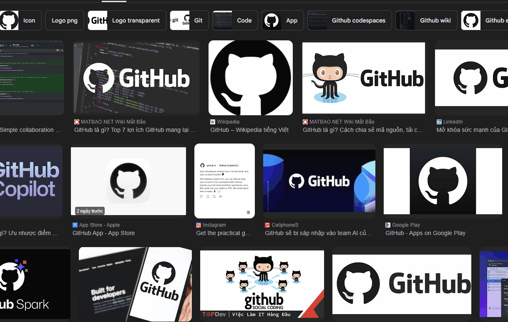

# 📦 Save Image As Type

A lightweight Chrome extension that lets you **save images in different formats (PNG, JPG, WebP)** directly from the right-click menu.

---

## 🇺🇸 English

### ✨ Features
- 🖱️ Right-click → Save as PNG / JPG / WebP  
- ⚡ Fast & lightweight  
- 🔒 100% local (no tracking, no API)  
- 🎯 Works on most websites  
- 🌐 Multi-language support  

### 🎬 Demo


### 🚀 Installation (Development)

1. Clone repository:
```bash
git clone https://github.com/vubinh127/save-image-as-type.git
cd save-image-as-type
```

2. Load into Chrome:
- Open: chrome://extensions/
- Enable Developer mode
- Click “Load unpacked”
- Select this folder

### ⚙️ How It Works
1. Right-click on an image  
2. Choose format (PNG/JPG/WebP)  
3. Image is processed via canvas  
4. Download starts automatically  

### ⚠️ Limitations
- Some images may fail due to CORS  
- Not supported on protected sites  
- JPG may reduce quality  

### 🛡️ Privacy
- No data collection  
- No external requests  
- Everything runs locally  

---

## 🇻🇳 Tiếng Việt

### ✨ Tính năng
- 🖱️ Chuột phải → Lưu ảnh dưới dạng PNG / JPG / WebP  
- ⚡ Nhanh, nhẹ  
- 🔒 Chạy hoàn toàn local, không tracking  
- 🎯 Hoạt động trên hầu hết website  
- 🌐 Hỗ trợ đa ngôn ngữ  

### 🎬 Demo


### 🚀 Cài đặt (Development)

1. Clone repo:
```bash
git clone https://github.com/vubinh127/save-image-as-type.git
cd save-image-as-type
```

2. Load vào Chrome:
- Mở: chrome://extensions/
- Bật Developer mode
- Chọn “Load unpacked”
- Chọn thư mục project

### ⚙️ Cách hoạt động
1. Chuột phải vào ảnh  
2. Chọn định dạng muốn lưu  
3. Extension xử lý qua canvas  
4. Tự động tải về  

### ⚠️ Hạn chế
- Một số ảnh bị chặn bởi CORS  
- Không hoạt động trên site bảo mật cao  
- JPG có thể giảm chất lượng  

### 🛡️ Quyền riêng tư
- Không thu thập dữ liệu  
- Không gọi API ngoài  
- Mọi thứ chạy trong trình duyệt  

---

## ⭐ Support

If you like this project, give it a ⭐ on GitHub!
